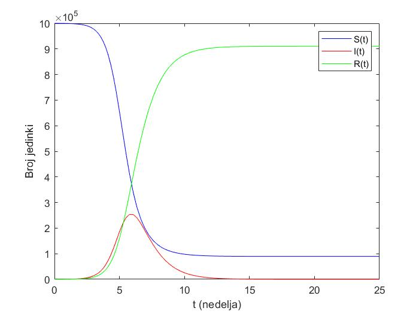
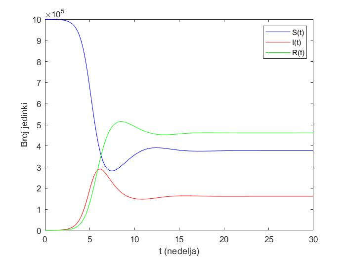
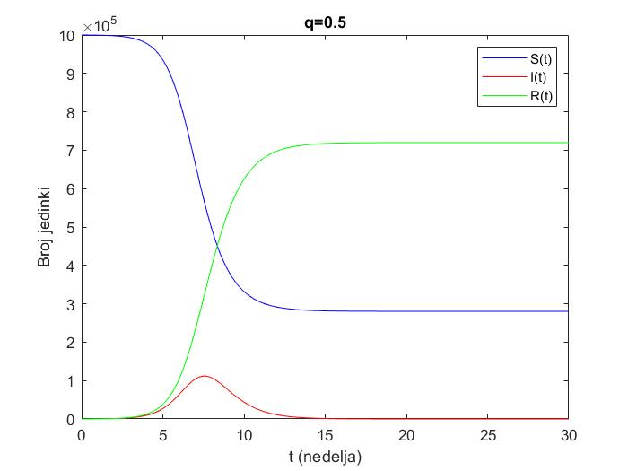
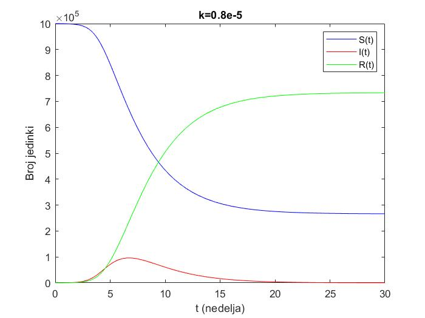
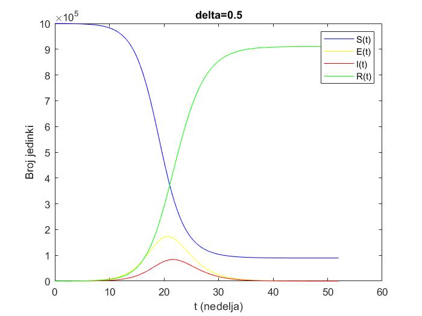

# epidemic-modelling
[Computer Modeling] SIR/SIRS/SIRQ/ISIR/SEIR comparmental models for numerical epidemic modelling in MATLAB.

Homework/project in **Practicum in Physics 2 (13E061PF2)** at University of Belgrade, School of Electrical Engineering.

## Comparmental models

### SIR model

- `S` is the number of susceptible individuals
- `I` is the number of infectious individuals
- `R` is the number of removed individuals (either immune or deceased)
- `α` is a constant that describes the infection rate
- `β` is a constant that describes the recovery rate

This model (`Solution/SIR.m`) is described using the following system of first-order differential equations:
```
dS(t)/dt = -α * S * I
dI(t)/dt = α * S * I - β * I
dR(t)/dt = β * I
```

The number of S/I/R individuals (for α = 2.65 * 10<sup>-6</sup>, β = 1) can be found below:


MATLAB scripts that use this model can be found in `Solution/SIRepidemija.m`, `Solution/SIR_R0virus.m`, and `Solution/SIR_R0opseg.m`.

### SIRS model

- `γ` is a constant that describes the rate of immunity loss among recovered individuals (for example due to virus mutations)

This model (`Solution/SIRS.m`) is described using the following system of first-order differential equations:
```
dS(t)/dt = -α * S * I + γ * R
dI(t)/dt = α * S * I - β * I
dR(t)/dt = β * I - γ * R
```

The number of S/I/R individuals (for α = 2.65 * 10<sup>-6</sup>, β = 1, γ = 0.35) can be found below:


A MATLAB script that uses this model can be found in `Solution/SIRSepidemija.m`.

### SIRQ model

- `q` is a constant that describes the rate of removal of infected individuals from the population
through preventive measures (for example quarantine)

This model (`Solution/SIRQ.m`) is described using the following system of first-order differential equations:
```
dS(t)/dt = -α * S * I
dI(t)/dt = α * S * I - (β + q) * I
dR(t)/dt = (β + q) * I
```

The number of S/I/R individuals (for α = 2.65 * 10<sup>-6</sup>, β = 1, q = 0.5) can be found below:


A MATLAB script that uses this model can be found in `Solution/SIRQepidemija.m`.

### ISIR model

- `k` is a constant that describes the impact of the transfer epidemic information (for example due to self-isolation and avoiding contact)

This model (`Solution/ISIR.m`) is described using the following system of first-order differential equations:
```
dS(t)/dt = -α(I) * S * I
dI(t)/dt = α(I) * S * I - β * I
dR(t)/dt = β * I
```

The number of S/I/R individuals (for α<sub>0</sub> = 2.65 * 10<sup>-6</sup>, β = 1, k = 0.8 * 10<sup>-5</sup>) can be found below:


A MATLAB script that uses this model can be found in `Solution/ISIRepidemija.m`.

### SEIR model

- `E` is the number of exposed individuals
- `δ` is a constant that describes the rate of transition of individuals from exposed to infectious population (for example due to the incubation period)

This model (`Solution/SEIR.m`) is described using the following system of first-order differential equations:
```
dS(t)/dt = -α * S * I
dE(t)/dt = α * S * I - δ * E
dI(t)/dt = δ * E - β * I
dR(t)/dt = β * I
```

The number of S/E/I/R individuals (for α = 2.65 * 10<sup>-6</sup>, β = 1, δ = 0.5) can be found below:


A MATLAB script that uses this model can be found in `Solution/SEIRepidemija.m`.
